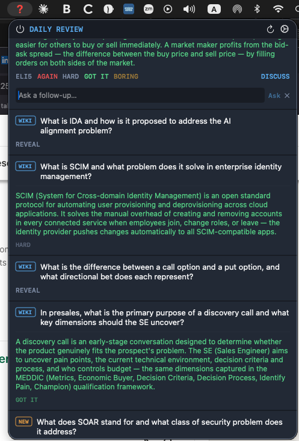
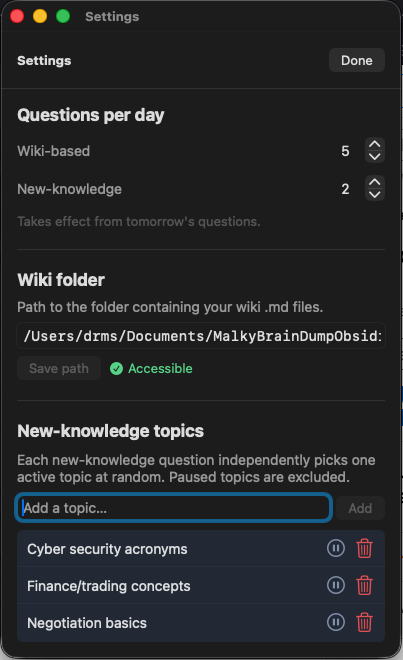

# Daily Review

A macOS menu bar app for daily spaced repetition learning, driven by a personal knowledge wiki and AI-generated questions.



*Main panel: a card with the ELI5 simplified answer active (ELI5 button lit), rating buttons (ELI5 / AGAIN / HARD / GOT IT / BORING / DISCUSS), and the Discuss follow-up input open on another card.*



*Settings: question counts per day, wiki folder path with accessibility check, and the new-knowledge topics list with per-topic pause and delete controls.*

## What it does

A **?** icon sits in the menu bar — red until all questions are answered, white when done. Each day presents flashcard-style questions drawn from your wiki and from topics you configure. Tap a card to reveal the answer, then rate it. Questions you didn't know carry over to tomorrow; questions you mastered are replaced overnight. You can ask Claude follow-ups or get a simplified ELI5 explanation directly from any card.

## How it works

### Daily flow

1. **Morning**: Open the panel — today's questions are ready (generated just after midnight)
2. **Review**: Tap any question card to reveal the answer, then rate it
3. **Discuss** (optional): Click DISCUSS to ask Claude a follow-up — answered inline with web search
4. **ELI5** (optional): Click ELI5 for a simplified explanation with links to helpful resources
5. **Just after midnight**: A launchd job runs at 00:10, calls `claude -p` to generate replacement questions, writes them to `~/.dailyreview/session.json` with tomorrow's date
6. **Next morning**: App reads the file, shows fresh questions

### Question types

| Badge | Source | On GOT IT |
|---|---|---|
| `WIKI` | Drawn from your wiki files | Replaced with a new wiki question |
| `NEW` | AI-generated on one of your configured topics | Auto-added to the wiki |

### Spaced repetition ratings

| Button | Meaning | Tomorrow |
|---|---|---|
| **ELI5** | Need a simpler explanation | Generates plain-language version with resource links; question carries over if rated AGAIN/HARD while ELI5 is showing |
| **AGAIN** | Forgot completely | Same question, rating reset |
| **HARD** | Partial recall | Same question, rating reset |
| **GOT IT** | Knew it | Replaced with a fresh question |
| **BORING** | Don't want to learn this | Replaced with a different subject |

Unanswered questions (not rated by end of day) carry over unchanged.

### ELI5

Any revealed, unrated card has an **ELI5** button. Clicking it asks Claude (with web search) to rewrite the answer in simpler terms with analogies and links to explainer articles or YouTube videos. The response renders as markdown — links are clickable and open in your browser. The ELI5 answer is cached on the card so repeated clicks are instant.

**SRS interaction**: if you rate AGAIN or HARD while the ELI5 view is showing, the next occurrence of that question will open in ELI5 mode by default (the original answer was clearly the sticking point). Rating GOT IT while in ELI5 mode advances the question normally.

### Discuss

Every revealed, unrated card also has a **DISCUSS** button. Type any follow-up question and hit Ask — Claude answers in context (using the card's Q&A as background) with web search enabled. A **← BACK** button returns to the original answer and rating buttons.

### New-knowledge topics

Open **Settings** (gear icon) to manage the topics used for `NEW` questions. Each question independently picks one active (non-paused) topic at random. Topics can be paused (excluded from selection) or deleted. Changes take effect from tomorrow's questions.

---

## Architecture

### App (`Sources/DailyReview/`)

Swift 6.2 / SwiftUI `MenuBarExtra` app. No network calls at runtime except when Discuss or ELI5 is used.

| File | Role |
|---|---|
| `DailyReviewApp.swift` | App entry point, icon generation (Core Text glyph path) |
| `AppStore.swift` | State management, session loading, `rateQuestion`, `addToWiki`, `runGenerateScript`, `askFollowUp`, `generateELI5`, `setELI5Answer` |
| `Models/Question.swift` | `Question`, `DaySession`, `SRSRating` models |
| `Services/WikiService.swift` | Appends Q&A to wiki files on GOT IT |
| `Views/MenuBarView.swift` | Panel layout, toolbar, question list |
| `Views/QuestionView.swift` | Card UI — reveal, ELI5, rating buttons, discuss flow |
| `Views/TopicInputView.swift` | "Manage topics →" button linking to Settings |
| `Views/SettingsView.swift` | Question counts, wiki folder path, topics list |

### Session file (`~/.dailyreview/session.json`)

Shared between the app and the nightly script. Written by both.

```json
{
  "dateString": "2026-06-01",
  "wikiQuestions": [...],
  "nonWikiQuestions": [...],
  "wikiQuestionCount": 5,
  "nonWikiQuestionCount": 2
}
```

Each question:
```json
{
  "id": "...",
  "text": "What is SASE?",
  "answer": "SASE (Secure Access Service Edge) converges...",
  "type": "wiki",
  "topic": "",
  "isRevealed": false,
  "isAddedToWiki": false,
  "srsRating": null,
  "eli5Answer": null,
  "eli5IsPreferred": false
}
```

`srsRating` is `null` until rated; one of `"miss"`, `"hazy"`, `"solid"`, `"boring"` after. `eli5Answer` is `null` until generated; `eli5IsPreferred` is `true` when the question should open in ELI5 mode next time.

### Topics file (`~/.dailyreview/topics.json`)

Managed by the app and read by the nightly script. Each `NEW` question independently draws from the active (non-paused) topics.

```json
[
  { "id": "...", "text": "Cybersecurity concepts", "isPaused": false },
  { "id": "...", "text": "Finance/trading",        "isPaused": true  }
]
```

### Nightly script (`~/.dailyreview/generate.sh`)

Runs via launchd at 00:10. Calls `claude -p` (Claude Code CLI, uses existing Claude Pro session — no separate API key). Claude outputs JSON to stdout; bash writes it to `session.json`.

**Arguments:**
- No args: nightly mode — writes tomorrow's date, carries over unrated questions
- `<date>`: override the target date
- `--fresh`: ignore current session, generate a completely new set (used by the ↺ button)

**Question generation rules:**
- `srsRating: null` — kept unchanged (not yet attempted)
- `srsRating: "miss"` or `"hazy"` — carried over with rating reset to null (retry tomorrow)
- `srsRating: "solid"` — replaced with a fresh question on a different concept
- `srsRating: "boring"` — replaced with a question from a noticeably different subject area
- `NEW` replacements randomly pick one active topic from `topics.json`

### launchd job (`~/Library/LaunchAgents/com.example.dailyreview.plist`)

Fires at 00:10 local time every night. Logs to `~/.dailyreview/launchd.log`.

---

## Design decisions

### Why launchd + `claude -p` instead of a remote scheduled agent

Claude Code's `/schedule` skill creates remote cloud agents. Remote agents have no access to local files — they can't read `~/.dailyreview/session.json` or the wiki. `claude -p` runs a local non-interactive Claude Code session that has full filesystem access and uses the existing Claude Pro subscription. No separate API key is needed.

### Why session data lives in a file, not UserDefaults

The nightly `generate.sh` script (a bash process, not the app) needs to read and write the session. UserDefaults is per-app and inaccessible to external processes. A plain JSON file at `~/.dailyreview/session.json` is readable by both.

### Why the icon is drawn as a glyph path, not a font render

The menu bar needs two explicit colour variants (red and white). Using `.isTemplate = true` lets macOS auto-colour a single image but doesn't support two distinct colours. `makeQuestionIcon(color:)` extracts the `?` glyph outline from Helvetica Bold via Core Text (`CTFontCreatePathForGlyph`), then fills it with the target colour using Core Graphics.

### Why ELI5 uses web search

A simplified explanation is most useful when it can point to a video or diagram that makes the concept click. `claude -p --allowedTools WebSearch` lets Claude include links to real resources. The response is rendered as markdown in the card, so links are clickable.

### Why ELI5 answers are cached and persist in session.json

Regenerating on every click would be slow (~15–30s). The cached answer also carries `eli5IsPreferred` so the app knows to show the simpler version by default on the next occurrence — no need for the user to click ELI5 again on a question that already proved confusing.

### Why GOT IT auto-adds to the wiki but HARD does not

GOT IT means the knowledge is internalised — it belongs in long-term notes. HARD means partial recall — adding it prematurely could pollute the wiki with half-understood material. HARD shows a manual "Add to wiki" button so the user can choose.

### Why BORING replaces rather than carries over

Carrying over a boring question would just keep surfacing something the user has decided they don't want to learn. Replacing it respects that decision and fills the slot with something from a different subject area.

### Why topics are per-question rather than shared across all NEW questions

If only one topic were used for an entire session, a bad topic choice would make every NEW question feel off. Each question picking independently means the session stays varied even when several topics are configured.

### Personal config via `~/.dailyreview/.env`

Values that differ between installs (wiki path, etc.) are read from `~/.dailyreview/.env`, not hardcoded. This keeps the source code generic for the public repo while allowing personal configuration without touching Settings. See `.env.example` for available variables.

---

## Setup

### Prerequisites

- macOS 26 or later
- Xcode with Swift 6.2
- [Claude Code CLI](https://claude.ai/code) installed and signed in with a Claude Pro subscription

### Install

```bash
# 1. Clone the repo
git clone https://github.com/drmalcs/daily-review
cd daily-review

# 2. Create your personal config
mkdir -p ~/.dailyreview
cp .env.example ~/.dailyreview/.env
# Edit ~/.dailyreview/.env and set WIKI_PATH to your wiki folder

# 3. Copy the nightly script
cp scripts/generate.sh ~/.dailyreview/generate.sh
chmod +x ~/.dailyreview/generate.sh

# 4. Install the launchd job (edit the plist to replace YOUR_USERNAME first)
cp scripts/com.example.dailyreview.plist ~/Library/LaunchAgents/
launchctl load ~/Library/LaunchAgents/com.example.dailyreview.plist

# 5. Build and install the app
bash scripts/build-app.sh
open ~/Applications/DailyReview.app
```

### First run

Click **↺** in the toolbar to generate your first set of questions (~30s). Thereafter, questions are generated automatically each night just after midnight.

**Settings** (gear icon): adjust question counts, override the wiki folder path, manage new-knowledge topics.

**Auto-start at login**: System Settings → General → Login Items → add DailyReview.

---

## Development

After making code changes:

```bash
bash scripts/build-app.sh   # rebuilds and reinstalls ~/Applications/DailyReview.app
pkill DailyReview && open ~/Applications/DailyReview.app
```

Click **↺** to generate a fresh set of questions dated today for testing without waiting for the nightly run.

---

## Logs

```
~/.dailyreview/generate.log   # script output (claude call, status, timing)
~/.dailyreview/launchd.log    # launchd stdout/stderr capture
```
