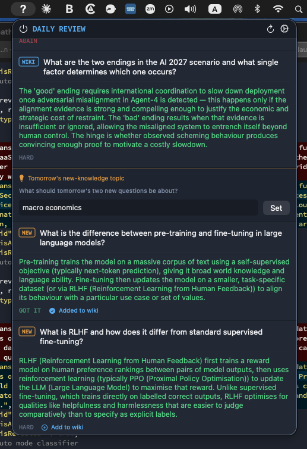

# Daily Review

A macOS menu bar app for daily spaced repetition learning, driven by a personal knowledge wiki and AI-generated questions.


*A revealed card showing AGAIN / HARD / GOT IT / BORING / DISCUSS buttons, alongside unrevealed cards. The banner indicates carryover questions from the previous day.*



*After all wiki questions are rated, the topic input box appears. GOT IT on a NEW question shows "Added to wiki" confirmation.*

## What it does

A **?** icon sits in the menu bar — red until all questions are answered, white when done. Each day presents a set of flashcard-style questions drawn from your wiki and optionally a topic you choose. Tap a card to reveal the answer, then rate it. Questions you didn't know carry over to tomorrow; questions you mastered are replaced with fresh ones overnight. You can discuss any question with Claude directly from the card, with web search available.

## How it works

### Daily flow

1. **Morning**: Open the panel — today's questions are ready (generated the previous night)
2. **Review**: Tap any question card to reveal the answer, then rate it
3. **Discuss** (optional): Click DISCUSS on any revealed card to ask Claude a follow-up question — the answer appears inline with web search enabled
4. **Set tomorrow's topic**: After all wiki questions are rated, an input box appears — type a topic for tomorrow's extra questions
5. **Tonight**: A launchd job runs at 23:00, calls `claude -p` to generate replacement questions, writes them to `~/.dailyreview/session.json` with tomorrow's date
6. **Next morning**: App reads the file, shows fresh questions

### Question types

| Badge | Source | On GOT IT |
|---|---|---|
| `WIKI` | Drawn from your wiki files | Replaced with a new wiki question |
| `NEW` | Extends the wiki / covers the topic you set | Auto-added to the wiki |

### Spaced repetition ratings

| Button | Meaning | Tomorrow |
|---|---|---|
| **AGAIN** | Forgot completely | Same question, rating reset |
| **HARD** | Partial recall | Same question, rating reset |
| **GOT IT** | Knew it | Replaced with a fresh question |
| **BORING** | Don't want to learn this | Replaced with a different subject |

Unanswered questions (not rated by end of day) carry over unchanged.

### Discuss

Every revealed, unrated card has a **DISCUSS** button. Clicking it opens a text field — type any follow-up question and hit Ask. Claude answers in context (using the card's Q&A as background) with web search enabled. A **← BACK** button returns to the original answer and rating buttons.

---

## Architecture

### App (`Sources/DailyReview/`)

Swift 6.2 / SwiftUI `MenuBarExtra` app. No network calls at runtime except when Discuss is used.

| File | Role |
|---|---|
| `DailyReviewApp.swift` | App entry point, icon generation (Core Text glyph path) |
| `AppStore.swift` | State management, session loading, `rateQuestion`, `addToWiki`, `runGenerateScript`, `askFollowUp` |
| `Models/Question.swift` | `Question`, `DaySession`, `SRSRating` models |
| `Services/WikiService.swift` | Appends Q&A to wiki files on GOT IT |
| `Views/MenuBarView.swift` | Panel layout, toolbar, question list |
| `Views/QuestionView.swift` | Card UI — reveal, rating buttons, discuss flow |
| `Views/TopicInputView.swift` | Tomorrow's topic input (appears after all wiki questions are rated) |
| `Views/SettingsView.swift` | Question counts, wiki folder path |

### Session file (`~/.dailyreview/session.json`)

Shared between the app and the nightly script. Written by both.

```json
{
  "dateString": "2026-06-01",
  "wikiQuestions": [...],
  "nonWikiQuestions": [...],
  "topicForTomorrow": "transformer attention mechanisms",
  "currentNonWikiTopic": "large language models",
  "wikiQuestionCount": 5,
  "nonWikiQuestionCount": 2
}
```

Each question:
```json
{
  "id": "...",
  "text": "What is SASE?",
  "answer": "SASE (Secure Access Service Edge) converges...",
  "type": "wiki",
  "isRevealed": false,
  "isAddedToWiki": false,
  "srsRating": null
}
```

`srsRating` is `null` until rated; one of `"miss"`, `"hazy"`, `"solid"`, `"boring"` after.

### Nightly script (`~/.dailyreview/generate.sh`)

Runs via launchd at 23:00. Calls `claude -p` (Claude Code CLI, uses existing Claude Pro session — no separate API key). Claude outputs JSON to stdout; bash writes it to `session.json`.

**Arguments:**
- No args: nightly mode — writes tomorrow's date, carries over unrated questions
- `<date>`: override the target date
- `--fresh`: ignore current session, generate a completely new set (used by the ↺ button)

**Question generation rules:**
- `srsRating: null` — kept unchanged (not yet attempted)
- `srsRating: "miss"` or `"hazy"` — carried over with rating reset to null (retry tomorrow)
- `srsRating: "solid"` — replaced with a fresh question on a different concept
- `srsRating: "boring"` — replaced with a question from a noticeably different subject area
- Non-wiki replacements extend the wiki or cover `topicForTomorrow` if set

### launchd job (`~/Library/LaunchAgents/com.example.dailyreview.plist`)

Fires at 23:00 local time every night. Logs to `~/.dailyreview/generate.log` and `launchd.log`.

---

## Design decisions

### Why launchd + `claude -p` instead of a remote scheduled agent

Claude Code's `/schedule` skill creates remote cloud agents. Remote agents have no access to local files — they can't read `~/.dailyreview/session.json` or the wiki. `claude -p` runs a local non-interactive Claude Code session that has full filesystem access and uses the existing Claude Pro subscription. No separate API key is needed.

### Why session data lives in a file, not UserDefaults

The nightly `generate.sh` script (a bash process, not the app) needs to read and write the session. UserDefaults is per-app and inaccessible to external processes. A plain JSON file at `~/.dailyreview/session.json` is readable by both.

### Why the icon is drawn as a glyph path, not a font render

The menu bar needs two explicit colour variants (red and white). Using `.isTemplate = true` lets macOS auto-colour a single image but doesn't support two distinct colours. `makeQuestionIcon(color:)` extracts the `?` glyph outline from Helvetica Bold via Core Text (`CTFontCreatePathForGlyph`), then fills it with the target colour using Core Graphics.

### Why GOT IT auto-adds to the wiki but HARD does not

GOT IT means the knowledge is internalised — it belongs in long-term notes. HARD means partial recall — adding it prematurely could pollute the wiki with half-understood material. HARD shows a manual "Add to wiki" button so the user can choose.

### Why BORING replaces rather than carries over

Carrying over a boring question would just keep surfacing something the user has decided they don't want to learn. Replacing it respects that decision and fills the slot with something from a different subject area.

### Why Discuss uses web search

Follow-up questions often need current information or deeper context than the card's answer provides. `claude -p --allowedTools WebSearch` enables this without requiring any additional setup or API keys beyond the existing Claude Pro session.

### Personal config via `~/.dailyreview/.env`

Values that differ between installs (wiki path, etc.) are read from `~/.dailyreview/.env`, not hardcoded. This keeps the source code generic for the public repo while allowing personal configuration without touching Settings. See `.env.example` for available variables.

---

## Setup

### Prerequisites

- macOS 26 or later
- Xcode with Swift 6.2
- [Claude Code CLI](https://claude.ai/code) installed and signed in with a Claude Pro subscription

### Install

```bash
# 1. Clone the repo
git clone https://github.com/drmalcs/daily-review
cd daily-review

# 2. Create your personal config
mkdir -p ~/.dailyreview
cp .env.example ~/.dailyreview/.env
# Edit ~/.dailyreview/.env and set WIKI_PATH to your wiki folder

# 3. Copy the nightly script
cp scripts/generate.sh ~/.dailyreview/generate.sh
chmod +x ~/.dailyreview/generate.sh

# 4. Install the launchd job (edit the plist to replace YOUR_USERNAME first)
cp scripts/com.example.dailyreview.plist ~/Library/LaunchAgents/
launchctl load ~/Library/LaunchAgents/com.example.dailyreview.plist

# 5. Build and install the app
bash scripts/build-app.sh
open ~/Applications/DailyReview.app
```

### First run

Click **↺** in the toolbar to generate your first set of questions (~30s). Thereafter, questions are generated automatically each night at 23:00.

**Settings** (gear icon): adjust wiki/non-wiki question counts, override the wiki folder path.

**Auto-start at login**: System Settings → General → Login Items → add DailyReview.

---

## Development

After making code changes:

```bash
bash scripts/build-app.sh   # rebuilds and reinstalls ~/Applications/DailyReview.app
pkill DailyReview && open ~/Applications/DailyReview.app
```

Click **↺** to generate a fresh set of questions dated today for testing without waiting for the nightly run.

---

## Logs

```
~/.dailyreview/generate.log   # script output (claude call, status, timing)
~/.dailyreview/launchd.log    # launchd stdout/stderr capture
```
